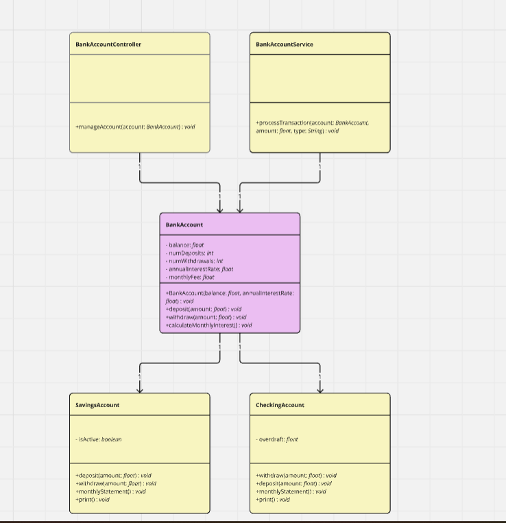
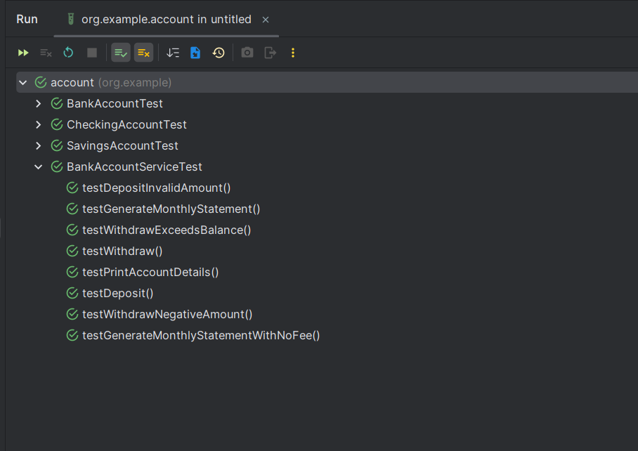

# <span style="color:blue;">Bank Account Management System 💳🏦

This project models a banking system with different types of bank accounts, including a basic account, savings account, and checking account. The system allows users to deposit and withdraw money, track the balance, and generate monthly statements. It also includes features for interest calculation, monthly fees, and overdraft management.

## 📑 <span style="color:green;">Table of Contents</span>

1. [Features 🛠️](#features)
2. [Requirements 📊](#requirements)
  - [Attributes 📝](#attributes)
  - [Methods 🧑‍💻](#methods)
  - [Classes 🏠](#classes)
3. [Unit Tests 🧪](#unit-tests)
4. [Instructions for Running Tests ▶️](#instructions-for-running-tests)
5. [License 📜](#license)

## 🛠️ <span style="color:yellow;">Features</span>

- **Bank Account** 💡:
  - Tracks the balance, annual interest rate, monthly fee, number of deposits, and number of withdrawals.
  - Provides methods to deposit, withdraw, calculate monthly interest, generate monthly statements, and print account details.

- **Savings Account** 💰:
  - Inherits from BankAccount and adds functionality to determine if the account is active based on the balance (if the balance is below $10,000, the account is inactive).
  - Restricts deposits and withdrawals to only occur if the account is active.
  - Charges an additional monthly fee if more than 4 withdrawals are made during the month.

- **Checking Account** 🏦:
  - Inherits from BankAccount and adds an overdraft feature.
  - Allows withdrawals beyond the balance, with the deficit being recorded as an overdraft.
  - Reduces the overdraft balance with deposits.

[](https://miro.com/app/board/uXjVLr88Rv0=/)

## 📊 <span style="color:yellow;">Requirements</span>

### 📝 1. **Attributes**:
- **Saldo (balance)**: float
- **Número de consignaciones**: int (initial value: 0)
- **Número de retiros**: int (initial value: 0)
- **Tasa anual**: float (annual interest rate as a percentage)
- **Comisión mensual**: float (initial value: 0)

### 🧑‍💻 2. **Methods**:
- **Consignar (deposit)**: Adds money to the account and updates the balance.
- **Retirar (withdraw)**: Removes money from the account, ensuring the withdrawal does not exceed the balance (unless the account is a checking account with overdraft).
- **Calcular interés mensual (calculateMonthlyInterest)**: Calculates the monthly interest and updates the balance accordingly.
- **Extracto mensual (monthlyStatement)**: Updates the balance after deducting the monthly fee and applying the monthly interest.
- **Imprimir (printAccountDetails)**: Returns the account details (balance, annual interest rate, monthly fee, number of transactions).

### 🏠 3. **Classes**:
- **Cuenta**: A base class with basic functionalities for any type of bank account.
- **Cuenta de Ahorros (Savings Account)**: Adds the condition that if the balance is below $10,000, the account becomes inactive, and restricts deposit and withdrawal operations if inactive. Includes additional fees for extra withdrawals.
- **Cuenta Corriente (Checking Account)**: Introduces overdraft functionality, where withdrawals can exceed the balance, but the excess amount is recorded as an overdraft. Deposits reduce the overdraft.

### 🧪 4. **Unit Tests**:
- Tests cover various scenarios such as deposits, withdrawals, interest calculation, account status, and monthly statements.
- **Coverage**: Minimum 70% test coverage.
  

## ▶️ **Instructions for Running Tests**

To run the unit tests in this project, follow these steps:

1. **Ensure Java is installed**:
- You can check if Java is installed by running the following command in your terminal:
  ```bash
  java -version
  ```
- If Java is not installed, download and install the [Java Development Kit (JDK)](https://www.oracle.com/java/technologies/javase-jdk11-downloads.html).

2. **Set up your development environment**:
- Make sure you have a development environment compatible with Java, such as [IntelliJ IDEA](https://www.jetbrains.com/idea/), [Eclipse](https://www.eclipse.org/), or a text editor with Java support.

3. **Compile and run tests using Maven**:
- If you're using Maven to manage the project, you can run the tests by executing the following command in your terminal:
  ```bash
  mvn test
  ```

4. **Compile and run tests using Gradle**:
- If you're using Gradle as your build tool, you can run the tests with the following command:
  ```bash
  gradle test
  ```

5. **Test results**:
- After running the tests, you will see the results in the terminal or the output files generated by the build tool. Tests that pass will be marked as successful, while failed tests will provide additional information to help diagnose the issue.

6. **Run tests from IDE (optional)**:
- Most Java IDEs support running tests directly within the IDE. Right-click the test file and choose "Run" to execute the tests.

---

## 📜 License

This project is licensed under the MIT License - see the [LICENSE](LICENSE) file for details.
